# Reonic EV Charging Station Simulator

A React application that simulates and visualizes EV charging station usage patterns to help optimize charging infrastructure planning.

## Tech Stack

- React 19 with TypeScript 5.8
- Chart.js 4.4 with react-chartjs-2 5.3
- Tailwind CSS 3 for styling
- i18next 24.2 for internationalization (English and German)
- React Testing Library with Jest for testing

## Requirements

- Node.js 22.x or higher
- Yarn package manager v1.22.x (npm is not recommended due to peer dependency issues)

## Features

- Interactive Simulation Parameters
  - Multiple charging point configurations
  - Adjustable charging speeds (5kW or higher)
  - Customizable arrival probability multiplier (20-200%)
  - Average car consumption settings
- Real-time Data Visualization
  - Power consumption per charging point (Bar Chart)
  - Daily usage patterns (Line Chart)
  - Charging efficiency distribution (Pie Chart)
  - Performance metrics (Radar Chart)
- Additional Features
  - Dark/Light theme support
  - Responsive design for all devices
  - Internationalization (English and German)
  - Real-time validation
  - Accessibility support

## Future Enhancements

- Validation Improvements
  - Charger speed conflict detection and warning messages
  - Enhanced form validation with detailed error messages
  - Toast notifications for user actions and errors
  - Loading indicators for client-side calculations
- UI/UX Improvements
  - Enhanced charger configuration interface
  - Animated transitions between states
  - Drag-and-drop charging point arrangement
- Additional Features
  - Export simulation results to CSV/PDF
  - Save and load simulation configurations
  - Compare multiple simulation scenarios

## Getting Started

1. Clone the repository:

```bash
git clone https://github.com/absurdengineer/reonic-ev-simulator.git
```

2. Install dependencies using Yarn:

```bash
cd reonic-ev-simulator
yarn install
```

3. Run the tests:

```bash
yarn test
```

4. Run the development server:

```bash
yarn start
```

5. Open [http://localhost:3000](http://localhost:3000) in your browser

## Development

### Available Scripts

- `yarn start` - Starts development server
- `yarn build` - Creates production build
- `yarn test` - Runs test suite
- `yarn eject` - Ejects CRA configuration

### Project Structure

```
src/
├── components/    # React components
├── hooks/        # Custom React hooks
├── i18n/         # Internationalization files
├── utils/        # Utility functions
└── tests/        # Test files
```

### Testing

The project uses React Testing Library and Jest for testing. Run tests with:

```bash
yarn test
```

## Screenshots

### Light Theme

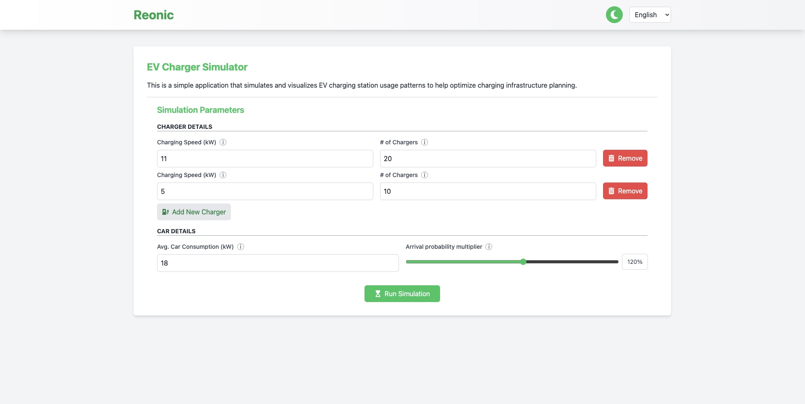
_Simulation Parameters Form - Light Theme_

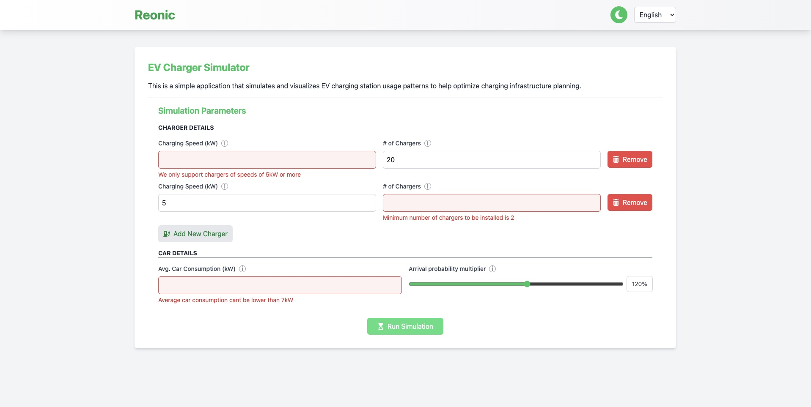
_Simulation Parameters Form with Errors - Light Theme_

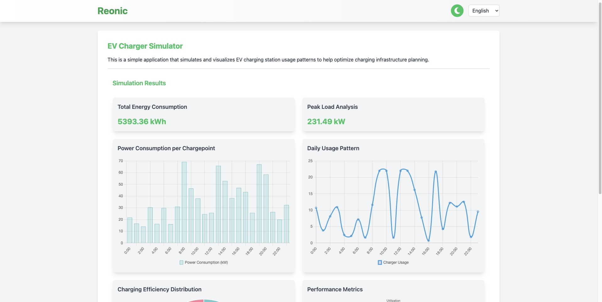
_Simulation Results - Light Theme_

### Dark Theme

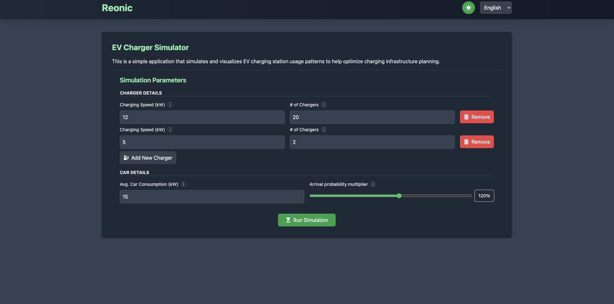
_Simulation Parameters Form - Dark Theme_

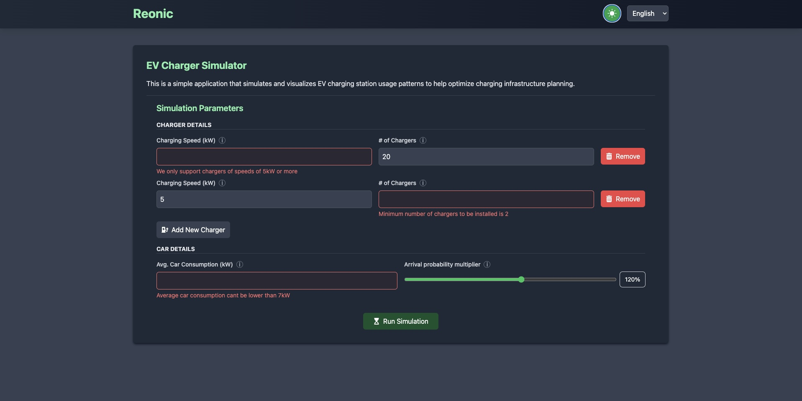
_Simulation Parameters Form with Errors - Dark Theme_

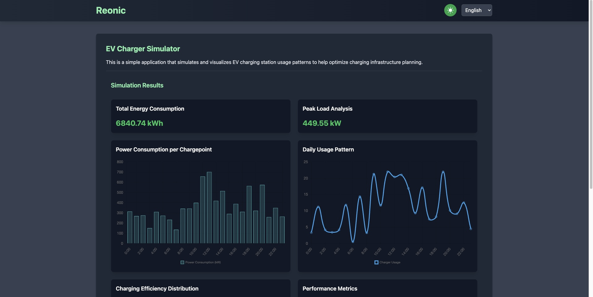
_Simulation Results - Dark Theme_

### Mobile View

#### Light

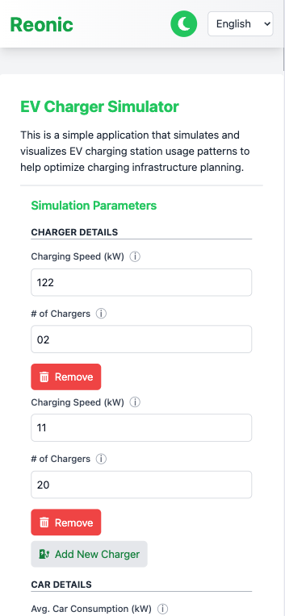
_Mobile View - Simulation Form_

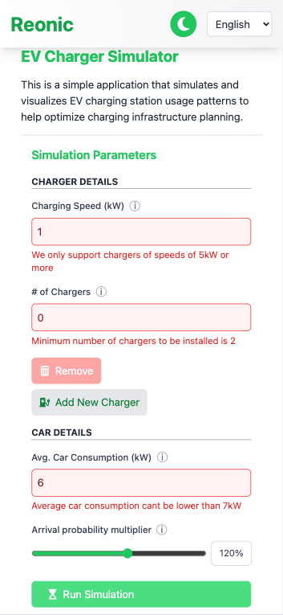
_Mobile View - Simulation Form with Errors_

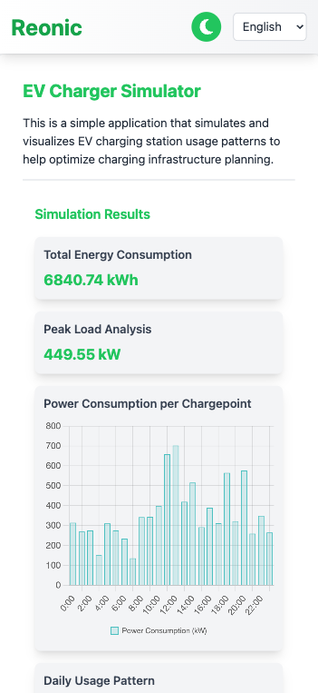
_Mobile View - Results_

#### Dark

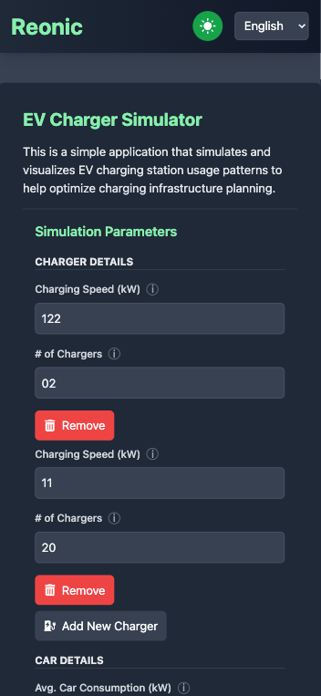
_Mobile View - Simulation Form_

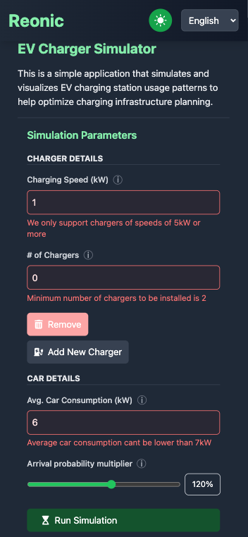
_Mobile View - Simulation Form with Errors_

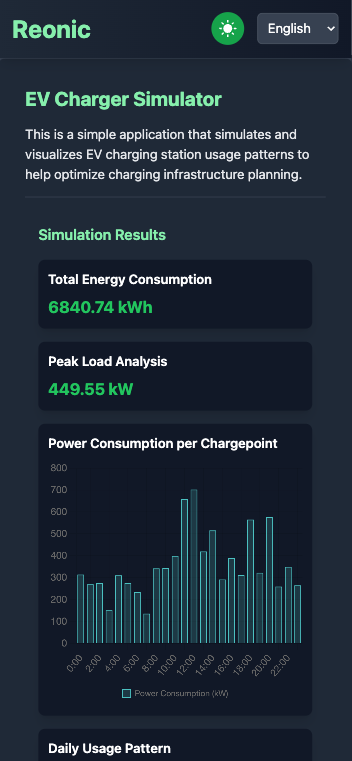
_Mobile View - Results_

## Contact

Mohammad Dilshad Alam - mddalam1@gmail.com
Project Link: [https://github.com/absurdengineer/reonic-ev-simulator](https://github.com/absurdengineer/reonic-ev-simulator)
